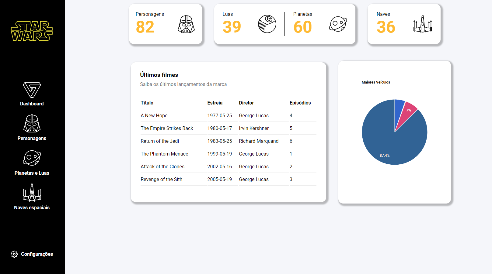

##Dashboard Star Wars

<h4 align="center"><a href="#">Clique para visitar o projeto</a></h4>

## 🎯 Objetivo

Projeto desenvolvido através do tutorial da [Papo de Dev](https://www.youtube.com/channel/UCRhKK6VrISnIWPJjYxBPKnA/featured). Onde criamos um Dashboard com os dados de Star Wars, consumidos através do [SWAPI API](https://swapi.dev/)

## 🛠️ Tecnologias utilizadas

Para o desenvolvimento deste site utilizei as seguintes tecnologias:

- HTML;
- CSS;
- JavaScript;
- JQuery;
- Axios;
- Google Chart;
